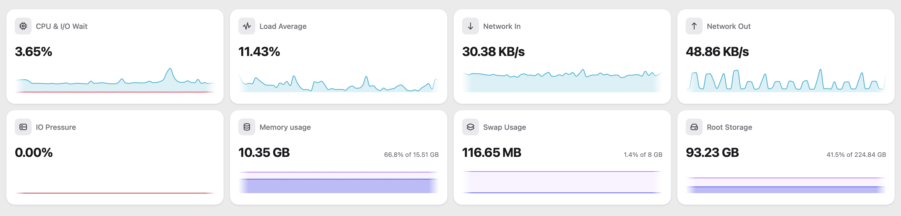

# Homie

A clean, lightweight Proxmox VE homelab monitoring dashboard.



## Features

- **Live Node Metrics** – Real-time sparkline KPI cards for CPU & I/O wait, load average, network I/O, memory, swap, IO pressure, and root storage.
- **Modern Full-Stack** – Built with React 19, [TanStack Start](https://tanstack.com/start), [TanStack Router](https://tanstack.com/router), [TanStack Charts](https://tanstack.com/charts), [HeroUI](https://heroui.com), and Tailwind CSS v4.
- **Fast Unified Toolchain** – Development, linting, testing, and bundling powered by [Vite+](https://github.com/voidzero-dev/vite-plus) (`vp`).
- **Production-Ready** – Self-contained standalone [Nitro](https://nitro.build) server output with Docker support.

## Getting Started

### Prerequisites

- [pnpm](https://pnpm.io/) (`v12+`)
- [Vite+](https://github.com/voidzero-dev/vite-plus) CLI (`vp`)

### Development

1. **Install dependencies**:

   ```bash
   pnpm install
   ```

2. **Configure environment variables**:

   ```bash
   cp .env.example .env
   ```

   Add your Proxmox API token and base URL in `.env`:

   ```env
   PROXMOX_TOKEN="PVEAPIToken=user@pam!tokenid=secret"
   PROXMOX_BASE_URL="https://example.com/api2/json/nodes/homelab/rrddata"
   ```

3. **Start the development server**:
   ```bash
   vp dev
   ```
   Open [http://localhost:8080](http://localhost:8080) in your browser.

## Docker Deployment

### Using Pre-built Image

Pull the image from GitHub Container Registry:

```bash
docker pull ghcr.io/stybo/homie:latest
```

Run directly with Docker:

```bash
docker run -d \
  --name homie \
  -p 8080:8080 \
  -e PROXMOX_TOKEN="PVEAPIToken=user@pam!tokenid=secret" \
  -e PROXMOX_BASE_URL="https://example.com/api2/json/nodes/homelab/rrddata" \
  ghcr.io/stybo/homie:latest
```

Or using Docker Compose:

```bash
docker compose -f compose.prod.yaml up -d
```

### Building Locally

To build and run locally with Docker Compose:

```bash
docker compose up -d --build
```

The app will be available at `http://localhost:8080`.

## Commands

| Command          | Description                                     |
| :--------------- | :---------------------------------------------- |
| `vp dev`         | Start development server                        |
| `vp check`       | Run linter, typecheck, and formatting checks    |
| `vp check --fix` | Auto-fix formatting and linting errors          |
| `vp test`        | Run Vitest test suite                           |
| `vp build`       | Build standalone production server (`.output/`) |
